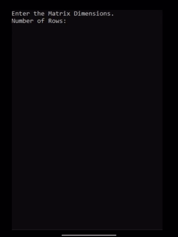
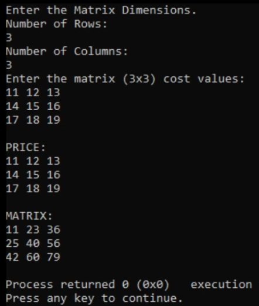

# cost-matrix

   
   For a React version of this [click here.](https://edwin-torres.github.io/github-page/#/projects/cost)
   
   Calculates the total cost (highest possible) to arrive at the position of a matrix element.  Movement is restricted to Right or Down.   →  ↓
       
   example:

   4 5 6
   
   7 4 2
   
   2 3 9

   It costs a total of 4 to arrive at [0][0].
   
   It costs a total of 9 (4+5) to arrive at [0][1].
   
   It costs a total of 15 (4+7+4) to arrive at [1][1].
   
   It costs a total of 13 (4+7+2) to arrive at [2][0]. etc.
   
   
   
   

 
